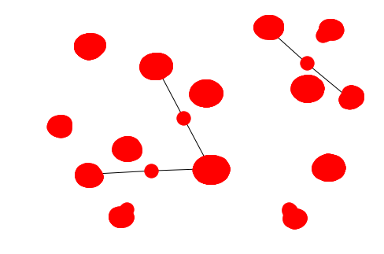

Second assignment of CIS 545 Big Data Analytics at University of Pennsylvania

## Step 1. Getting Started with Apache Spark

### Step 1.1 Initializing a Connection to Spark

We'll open a connection to Spark as follows.


```python
import numpy as np
import pandas as pd

import time
import networkx as nx
import warnings

from pyspark.sql import SparkSession
from pyspark.sql.types import *
import pyspark.sql.functions as F

import os

spark = SparkSession.builder.appName('Graphs-HW2').getOrCreate()
```

### Step 1.2 Download data

The following code retrieves the Yelp dataset in a zipfile and decompresses it.


```python
import zipfile
import urllib.request
import shutil
import os

def get_and_unzip(url,file_name):
    urllib.request.urlretrieve(url, file_name)
    zip_ref = zipfile.ZipFile(file_name,'r')
    zip_ref.extractall()
    zip_ref.close()

if os.path.exists("data"): 
    os.system('rm -rf data/')
os.mkdir("data")
os.chdir("data")
get_and_unzip("http://www.cis.upenn.edu/~cis545/yelp-dataset.zip","yelp-dataset.zip")
os.chdir("..")
```

### Step 1.3 Load Our Graph Datasets.

Here, we’ll be looking at graph data (reviews, reviewers, businesses) downloaded from Yelp.


```python
# Load Yelp datasets

yelp_business_attributes_sdf = spark.read.load('data/yelp_business_attributes.csv', format="csv", header=True)
yelp_business_hours_sdf = spark.read.load('data/yelp_business_hours.csv', format="csv", header=True)
yelp_business_sdf = spark.read.load('data/yelp_business.csv', format="csv", header=True)
yelp_check_in_sdf = spark.read.load('data/yelp_checkin.csv', format="csv", header=True)
yelp_reviews_sdf = spark.read.load('data/yelp_review2.csv', format="csv", header=True)
yelp_users_sdf = spark.read.load('data/yelp_user.csv', format="csv", header=True)
```


```python
yelp_business_hours_sdf.show(5)
```

    +--------------------+---------+---------+---------+---------+---------+---------+---------+
    |         business_id|   monday|  tuesday|wednesday| thursday|   friday| saturday|   sunday|
    +--------------------+---------+---------+---------+---------+---------+---------+---------+
    |FYWN1wneV18bWNgQj...|7:30-17:0|7:30-17:0|7:30-17:0|7:30-17:0|7:30-17:0|     None|     None|
    |He-G7vWjzVUysIKrf...| 9:0-20:0| 9:0-20:0| 9:0-20:0| 9:0-20:0| 9:0-16:0| 8:0-16:0|     None|
    |KQPW8lFf1y5BT2Mxi...|     None|     None|     None|     None|     None|     None|     None|
    |8DShNS-LuFqpEWIp0...|10:0-21:0|10:0-21:0|10:0-21:0|10:0-21:0|10:0-21:0|10:0-21:0|11:0-19:0|
    |PfOCPjBrlQAnz__NX...| 11:0-1:0| 11:0-1:0| 11:0-1:0| 11:0-1:0| 11:0-1:0| 11:0-2:0| 11:0-0:0|
    +--------------------+---------+---------+---------+---------+---------+---------+---------+
    only showing top 5 rows
    
    


```python
yelp_check_in_sdf.show(10)
```

    +--------------------+-------+-----+--------+
    |         business_id|weekday| hour|checkins|
    +--------------------+-------+-----+--------+
    |3Mc-LxcqeguOXOVT_...|    Tue| 0:00|      12|
    |SVFx6_epO22bZTZnK...|    Wed| 0:00|       4|
    |vW9aLivd4-IorAfSt...|    Tue|14:00|       1|
    |tEzxhauTQddACyqdJ...|    Fri|19:00|       1|
    |CEyZU32P-vtMhgqRC...|    Tue|17:00|       1|
    |9dn5pee_n2dWQfN57...|    Sun| 3:00|       5|
    |6Zk5F7fsTr8n2CJTl...|    Wed| 1:00|       4|
    |OE_IDW5w_W97sBcZv...|    Sat| 1:00|       1|
    |gy5pr5bFAjOL5rERS...|    Sat|15:00|       1|
    |r2-eAhGANXlcgQy89...|    Mon|19:00|       1|
    +--------------------+-------+-----+--------+
    only showing top 10 rows
    
    


```python
yelp_business_sdf.show(5)
```

    +--------------------+--------------------+------------+--------------------+--------------+-----+-----------+----------+------------+-----+------------+-------+--------------------+
    |         business_id|                name|neighborhood|             address|          city|state|postal_code|  latitude|   longitude|stars|review_count|is_open|          categories|
    +--------------------+--------------------+------------+--------------------+--------------+-----+-----------+----------+------------+-----+------------+-------+--------------------+
    |FYWN1wneV18bWNgQj...|    Dental by Design|        null|4855 E Warner Rd,...|     Ahwatukee|   AZ|      85044|33.3306902|-111.9785992|  4.0|          22|      1|Dentists;General ...|
    |He-G7vWjzVUysIKrf...| Stephen Szabo Salon|        null|  3101 Washington Rd|      McMurray|   PA|      15317|40.2916853| -80.1048999|  3.0|          11|      1|Hair Stylists;Hai...|
    |KQPW8lFf1y5BT2Mxi...|Western Motor Veh...|        null|6025 N 27th Ave, ...|       Phoenix|   AZ|      85017|33.5249025|-112.1153098|  1.5|          18|      1|Departments of Mo...|
    |8DShNS-LuFqpEWIp0...|    Sports Authority|        null|5000 Arizona Mill...|         Tempe|   AZ|      85282|33.3831468|-111.9647254|  3.0|           9|      0|Sporting Goods;Sh...|
    |PfOCPjBrlQAnz__NX...|Brick House Taver...|        null|        581 Howe Ave|Cuyahoga Falls|   OH|      44221|41.1195346| -81.4756898|  3.5|         116|      1|American (New);Ni...|
    +--------------------+--------------------+------------+--------------------+--------------+-----+-----------+----------+------------+-----+------------+-------+--------------------+
    only showing top 5 rows
    
    

### Step 1.4 Simple Wrangling in Spark DataFrames

Currently, some of the data from the Yelp dataset is a bit ugly.

In this section we will:
* Create SQL tables for each Spark DataFrames you created in the previous step.
* Clean `yelp_business_hours` by replacing `"None"` with a Spark `null`.
* Clean `yelp_users` by replacing `"None"` with a Spark `null`.

### Step 1.4.1 Spark DataFrames SQL Tables


```python
# Create SQL tables with names such as yelp_business, yelp_users

yelp_business_attributes_sdf.createOrReplaceTempView('yelp_business_attributes')
yelp_business_hours_sdf.createOrReplaceTempView('yelp_business_hours')
yelp_business_sdf.createOrReplaceTempView('yelp_business')
yelp_check_in_sdf.createOrReplaceTempView('yelp_check_in')
yelp_reviews_sdf.createOrReplaceTempView('yelp_reviews')
yelp_users_sdf.createOrReplaceTempView('yelp_users')
```

### Step 1.4.2 Cleaning None's
Define a function `replace_none_with_null` to convert the string `"None"` to Spark `null`.


```python
# Create replace_none_with_null function

def replace_none_with_null(x):
    # This function should take a string parameter and compare it with 
    # 'None' and 'Na'. If there is a match to either, it should return
    # the Python None value otherwise it should return the passed value.

    # *** YOUR CODE HERE ***
    if x == 'None' or x == 'Na':
        return None
    else:
        return x
```


```python
# The following code wraps the Python code in a Spark UDF

from pyspark.sql.functions import udf
from pyspark.sql.types import StringType, NullType

spark.udf.register('replace_none_with_null', replace_none_with_null,StringType())
spark_replace_none_with_null = udf(replace_none_with_null, StringType())
```

Now we'll use the above created UDF to replace the 'None's and 'Na's from `yelp_business_hours_sdf` and `yelp_users`.


```python
# Clean yelp_business_hours_sdf

columns = ['business_id', 'monday', 'tuesday', 'wednesday', 'thursday', 'friday', 'saturday', 'sunday']

for column in columns:
    yelp_business_hours_sdf = yelp_business_hours_sdf.withColumn(column, spark_replace_none_with_null(column))

yelp_business_hours_sdf.createOrReplaceTempView('yelp_business_hours')
```


```python
# Clean yelp_users

columns = ['user_id', 'name', 'review_count', 'yelping_since', 'friends', 'useful', 'funny', 'cool', 'fans', 'elite', 
       'average_stars', 'compliment_hot', 'compliment_more', 'compliment_profile', 'compliment_cute', 'compliment_list', 
       'compliment_note', 'compliment_plain', 'compliment_cool', 'compliment_funny', 'compliment_writer', 'compliment_photos']

for column in columns:
    yelp_users_sdf = yelp_users_sdf.withColumn(column, spark_replace_none_with_null(column))

yelp_users_sdf.createOrReplaceTempView('yelp_users')
```


```python
# Make sure the SDF's were cleaned correctly
yelp_business_hours_sdf.show(10)
yelp_users_sdf.show(10)
```

    +--------------------+---------+---------+---------+---------+---------+---------+---------+
    |         business_id|   monday|  tuesday|wednesday| thursday|   friday| saturday|   sunday|
    +--------------------+---------+---------+---------+---------+---------+---------+---------+
    |FYWN1wneV18bWNgQj...|7:30-17:0|7:30-17:0|7:30-17:0|7:30-17:0|7:30-17:0|     null|     null|
    |He-G7vWjzVUysIKrf...| 9:0-20:0| 9:0-20:0| 9:0-20:0| 9:0-20:0| 9:0-16:0| 8:0-16:0|     null|
    |KQPW8lFf1y5BT2Mxi...|     null|     null|     null|     null|     null|     null|     null|
    |8DShNS-LuFqpEWIp0...|10:0-21:0|10:0-21:0|10:0-21:0|10:0-21:0|10:0-21:0|10:0-21:0|11:0-19:0|
    |PfOCPjBrlQAnz__NX...| 11:0-1:0| 11:0-1:0| 11:0-1:0| 11:0-1:0| 11:0-1:0| 11:0-2:0| 11:0-0:0|
    |o9eMRCWt5PkpLDE0g...| 18:0-0:0| 18:0-0:0| 18:0-0:0| 18:0-0:0| 18:0-0:0| 18:0-0:0|     null|
    |kCoE3jvEtg6UVz5SO...| 8:0-17:0| 8:0-17:0| 8:0-17:0| 8:0-17:0| 8:0-17:0|     null|     null|
    |OD2hnuuTJI9uotcKy...|11:0-19:0|11:0-19:0|11:0-19:0|11:0-19:0|11:0-19:0|10:0-18:0|11:0-16:0|
    |EsMcGiZaQuG1OOvL9...|     null|     null|     null|     null|     null|     null|     null|
    |TGWhGNusxyMaA4kQV...| 9:0-18:0| 9:0-18:0| 9:0-18:0| 9:0-18:0| 9:0-18:0| 9:0-18:0| 9:0-18:0|
    +--------------------+---------+---------+---------+---------+---------+---------+---------+
    only showing top 10 rows
    
    +--------------------+-------+------------+-------------+--------------------+------+-----+----+----+-----+-------------+--------------+---------------+------------------+---------------+---------------+---------------+----------------+---------------+----------------+-----------------+-----------------+
    |             user_id|   name|review_count|yelping_since|             friends|useful|funny|cool|fans|elite|average_stars|compliment_hot|compliment_more|compliment_profile|compliment_cute|compliment_list|compliment_note|compliment_plain|compliment_cool|compliment_funny|compliment_writer|compliment_photos|
    +--------------------+-------+------------+-------------+--------------------+------+-----+----+----+-----+-------------+--------------+---------------+------------------+---------------+---------------+---------------+----------------+---------------+----------------+-----------------+-----------------+
    |JJ-aSuM4pCFPdkfoZ...|  Chris|          10|   2013-09-24|0njfJmB-7n84DlIgU...|     0|    0|   0|   0| null|          3.7|             0|              0|                 0|              0|              0|              0|               0|              0|               0|                0|                0|
    |uUzsFQn_6cXDh6rPN...|  Tiffy|           1|   2017-03-02|                null|     0|    0|   0|   0| null|          2.0|             0|              0|                 0|              0|              0|              0|               0|              0|               0|                0|                0|
    |mBneaEEH5EMyxaVyq...|   Mark|           6|   2015-03-13|                null|     0|    0|   0|   0| null|         4.67|             0|              0|                 0|              0|              0|              0|               0|              0|               0|                0|                0|
    |W5mJGs-dcDWRGEhAz...| Evelyn|           3|   2016-09-08|                null|     0|    0|   0|   0| null|         4.67|             0|              0|                 0|              0|              0|              0|               0|              0|               0|                0|                0|
    |4E8--zUZO1Rr1IBK4...|   Lisa|          11|   2012-07-16|                null|     4|    0|   0|   0| null|         3.45|             0|              0|                 0|              0|              0|              0|               0|              0|               0|                1|                0|
    |Ob-2oGBQ7rwwYwUvh...|      B|           9|   2012-05-01|                null|     0|    0|   0|   0| null|         4.78|             0|              0|                 0|              0|              0|              0|               0|              0|               0|                0|                0|
    |JaTVvKsBl0bHHJEpE...|  Peter|           2|   2013-03-23|                null|     0|    0|   0|   0| null|          5.0|             0|              0|                 0|              0|              0|              0|               0|              0|               0|                0|                0|
    |Ykj0DVsz0c6rX9ghj...|Colleen|           1|   2010-10-10|                null|     0|    0|   0|   0| null|          1.0|             0|              0|                 0|              0|              0|              0|               0|              0|               0|                0|                0|
    |kmyEPfKnHQJdTceCd...|      A|           7|   2012-10-16|                null|     0|    0|   0|   0| null|         4.29|             0|              0|                 0|              0|              0|              0|               0|              0|               0|                0|                0|
    |H54pA7YHfjl8IjhHA...|   Chad|           3|   2010-06-25|                null|     0|    0|   0|   0| null|          5.0|             0|              0|                 0|              0|              0|              0|               0|              0|               0|                0|                0|
    +--------------------+-------+------------+-------------+--------------------+------+-----+----+----+-----+-------------+--------------+---------------+------------------+---------------+---------------+---------------+----------------+---------------+----------------+-----------------+-----------------+
    only showing top 10 rows
    
    

### Step 1.5 Simple Analytics on the Data

In this section, we will be executing Spark operations on the data given.

#### 1.5.1 Most reviewed business in PA 


```python
PA_most_reviewed_sdf = yelp_business_sdf[(yelp_business_sdf.state == 'PA') & (yelp_business_sdf.stars >= 4.0)].\
orderBy(["review_count", "name"], ascending=[0, 1])[['name', 'stars', 'review_count']]
```


```python
PA_most_reviewed_sdf.show(10)
```

    +--------------------+-----+------------+
    |                name|stars|review_count|
    +--------------------+-----+------------+
    |Tootie's Famous I...|  4.0|          99|
    |Vincent's Pizza Park|  4.0|          99|
    |      Brew Gentlemen|  4.5|          98|
    |              Lot 17|  4.0|          98|
    |             Peppi's|  4.5|          98|
    |       Totin's Diner|  4.0|          98|
    | East End Food Co-Op|  4.5|          97|
    |       Hidden Harbor|  4.5|          97|
    |   Kavsar Restaurant|  4.5|          97|
    |     Pizza Perfectta|  4.0|          97|
    +--------------------+-----+------------+
    only showing top 10 rows
    
    

#### 1.5.2 Businesses with the highest average review


```python
yelp_reviews_sdf = yelp_reviews_sdf.withColumn("stars", yelp_reviews_sdf["stars"].cast("double"))
yelp_star_sdf = yelp_reviews_sdf.groupBy('business_id').agg(F.avg("stars").alias("avg_rating"))

best_businesses_sdf = yelp_star_sdf.join(yelp_business_sdf, yelp_star_sdf.business_id == yelp_business_sdf.business_id)[['name', 'avg_rating']]
best_businesses_sdf = best_businesses_sdf.orderBy(["avg_rating", "name"], ascending=[0, 1])
```


```python
best_businesses_sdf.show(10)
```

    +--------------------+----------+
    |                name|avg_rating|
    +--------------------+----------+
    |"""T""s Hair Affair"|       5.0|
    |"Davis ""N"" Sons...|       5.0|
    |"Manantial De Sal...|       5.0|
    | "Scotty""s Kitchen"|       5.0|
    |"Wallbeds ""n"" M...|       5.0|
    |   $40 Backflow Test|       5.0|
    |  'Round Table Tours|       5.0|
    |           007 Nails|       5.0|
    |         1 One Armor|       5.0|
    |              1 Reef|       5.0|
    +--------------------+----------+
    only showing top 10 rows
    
    

#### 1.5.3 Difference from average in PA


```python
new_yelp_business_sdf = yelp_business_sdf[yelp_business_sdf['state'] == 'PA'][['business_id', 'name', 'stars']]
new_yelp_business_sdf = new_yelp_business_sdf.withColumn('stars', new_yelp_business_sdf["stars"].cast("double"))

mean = new_yelp_business_sdf.groupBy().avg("stars").take(1)[0][0]
new_yelp_business_sdf = new_yelp_business_sdf.withColumn("avg_stars", F.lit(mean))
new_yelp_business_sdf = new_yelp_business_sdf.withColumn('avg_stars_diff', new_yelp_business_sdf['stars'] - new_yelp_business_sdf['avg_stars'])

new_yelp_business_sdf = new_yelp_business_sdf[['business_id', 'name', 'stars', 'avg_stars_diff']]

new_yelp_business_sdf = new_yelp_business_sdf.orderBy('avg_stars_diff', ascending = True)
```


```python
new_yelp_business_sdf.show(10)
```

    +--------------------+--------------------+-----+-------------------+
    |         business_id|                name|stars|     avg_stars_diff|
    +--------------------+--------------------+-----+-------------------+
    |OPdjBa5toeaVsDleg...|Authentic Pizzeri...|  1.0|-2.6071817192600655|
    |fTinoZylgiozO8-LR...|         Dairy Queen|  1.0|-2.6071817192600655|
    |nzDlfPBEZDMJEsWw6...|        Owl Cleaners|  1.0|-2.6071817192600655|
    |5rinwJ0Xs-Ay5GmAn...|              Levelz|  1.0|-2.6071817192600655|
    |GMuWEVS9hqsWLj5c5...|Jack's Custom Tai...|  1.0|-2.6071817192600655|
    |FO2SNKF9I8mvTCAvb...|       Pizza Palermo|  1.0|-2.6071817192600655|
    |4IO9anlf46sejlK3F...|    Beasley Plumbing|  1.0|-2.6071817192600655|
    |0FJHkWgCsvgDjWQyR...|Allegheny Imaging...|  1.0|-2.6071817192600655|
    |6IKgKHZci-8mUtnvG...|The Cascades Town...|  1.0|-2.6071817192600655|
    |ijLB6_VUIH4rSOELp...|Jemco Plumbing & ...|  1.0|-2.6071817192600655|
    +--------------------+--------------------+-----+-------------------+
    only showing top 10 rows
    
    

#### 1.5.4 Most common check-in days/times times in PA


```python
split_time = F.split(yelp_check_in_sdf['hour'], ':')
new_yelp_check_in_sdf = yelp_check_in_sdf.withColumn('hour', split_time.getItem(0))

PA_yelp_business_sdf = yelp_business_sdf[yelp_business_sdf['state'] == 'PA']

common_PA_checkin_sdf = new_yelp_check_in_sdf.join(PA_yelp_business_sdf, new_yelp_check_in_sdf.business_id == PA_yelp_business_sdf.business_id)
common_PA_checkin_sdf = common_PA_checkin_sdf.groupBy(['weekday', 'hour']).agg(F.sum('checkins').alias('num_checkins'))
```


```python
common_PA_checkin_sdf.show(10)
```

    +-------+----+------------+
    |weekday|hour|num_checkins|
    +-------+----+------------+
    |    Fri|   3|      1376.0|
    |    Fri|   5|       450.0|
    |    Wed|   2|      1896.0|
    |    Sat|  11|       893.0|
    |    Sun|   6|       484.0|
    |    Tue|  15|      3843.0|
    |    Thu|  10|       793.0|
    |    Sun|  14|      4341.0|
    |    Tue|  20|      3483.0|
    |    Wed|  11|      1626.0|
    +-------+----+------------+
    only showing top 10 rows
    
    

# Step 2. Simple Graph Algorithms

## 2.1 Generate user-business graph

For this step, we will construct a *directed* graph with edges from users to businesses indicating reviews.


```python
review_graph_sdf = yelp_reviews_sdf[['user_id', 'business_id', 'stars']]

review_graph_sdf = review_graph_sdf.na.drop(subset=["user_id"])
review_graph_sdf = review_graph_sdf.na.drop(subset=["business_id"])
```


```python
review_graph_sdf.createOrReplaceTempView('review_graph')
```


```python
review_graph_sdf.show(10)
```

    +--------------------+--------------------+-----+
    |             user_id|         business_id|stars|
    +--------------------+--------------------+-----+
    |bv2nCi5Qv5vroFiqK...|AEx2SYEUJmTxVVB18...|  5.0|
    |bv2nCi5Qv5vroFiqK...|VR6GpWIda3SfvPC-l...|  5.0|
    |bv2nCi5Qv5vroFiqK...|CKC0-MOWMqoeWf6s-...|  5.0|
    |bv2nCi5Qv5vroFiqK...|ACFtxLv8pGrrxMm6E...|  4.0|
    |bv2nCi5Qv5vroFiqK...|s2I_Ni76bjJNK9yG6...|  4.0|
    |_4iMDXbXZ1p1ONG29...|8QWPlVQ6D-OExqXoa...|  5.0|
    |u0LXt3Uea_GidxRW1...|9_CGhHMz8698M9-Pk...|  4.0|
    |u0LXt3Uea_GidxRW1...|gkCorLgPyQLsptTHa...|  4.0|
    |u0LXt3Uea_GidxRW1...|5r6-G9C4YLbC7Ziz5...|  3.0|
    |u0LXt3Uea_GidxRW1...|fDF_o2JPU8BR1Gya-...|  5.0|
    +--------------------+--------------------+-----+
    only showing top 10 rows
    
    

## 2.2 Distributed Breadth-First Search

### 2.2.1 Breadth-First Search Algorithm

Here, we'll create a function `spark_bfs(G, origins, max_depth)` that takes a Spark DataFrame with a graph G (following the schema for `review_graph_sdf` described above, but to be treated as an **undirected graph**), a Python list-of-dictionaries `origins` of the form 

```
[{‘node’: nid1}, 
 {‘node’: nid2}, 
 …]
```

and a nonnegative integer “exploration depth” `max_depth` (to only run BFS on a tractable portion of the graph).  The `max_depth` will be the maximum number of edge traversals (e.g., the origin is at `max_depth=0`, one hop from the origin is `max_depth=1`, etc.  The function should return a DataFrame containing pairs of the form (node, distance), where the distance is depth at which $n$ was *first* encountered (i.e., the shortest-path distance from the origin nodes).


```python
# Write Spark BFS Functions
schema1 = StructType([StructField("node", StringType(), True)])
schema2 = StructType([StructField("node", StringType(), True), StructField("distance", IntegerType(), True)])

def spark_bfs(G, origins, max_depth):
    another_G = G.select(G['business_id'].alias('user_id'), 
                         G['user_id'].alias('business_id'), 
                         G['stars'].alias('stars')).cache()
    final_G = G.union(another_G).cache()
    
    # ** YOUR CODE HERE **
    unexplored_sdf = final_G.repartition(100, 'user_id').cache()
    frontier_sdf = spark.createDataFrame(origins, schema1).cache()
    visited_sdf = spark.createDataFrame(origins, schema2).cache()
    visited_sdf = visited_sdf.union(frontier_sdf.withColumn('distance', F.lit(0))).cache()
    visited_sdf = visited_sdf.filter(visited_sdf["distance"] == 0).cache()
    
    for i in range(0, max_depth):
        unexplored_sdf = unexplored_sdf.join(frontier_sdf, unexplored_sdf['business_id'] == frontier_sdf.node, how='left_anti').cache()
        next_sdf = unexplored_sdf.join(frontier_sdf, unexplored_sdf['user_id'] == frontier_sdf.node, how='inner').cache()
        next_sdf = next_sdf.select(next_sdf['business_id'].alias('node')).cache()
        visited_sdf = visited_sdf.union(next_sdf.withColumn('distance', F.lit(i+1))).cache()
        frontier_sdf = next_sdf.cache()
        
    visited_sdf = visited_sdf.groupBy('node').agg(F.min('distance').alias('distance'))
        
    another_G.unpersist()
    final_G.unpersist()
    unexplored_sdf.unpersist()
    frontier_sdf.unpersist()
    visited_sdf.unpersist()
    next_sdf.unpersist()
    
    return visited_sdf
```


```python
# Example

orig  = [{'node': 'bv2nCi5Qv5vroFiqKGopiw'}] 
count = spark_bfs(review_graph_sdf, orig, 3).count()
print(count)
```

    13603
    

### Step 2.2.2 Restaurant Recommendation

Now we'll create a function `friend_rec` that takes in two arguments: the graph_sdf and the ID of a user, `user`.  Using the `spark_bfs()` as a help function it should return restaurants with a rating greater than 4.0 that were reviewed by users who reviewed similar restaurants as `user` reviewed.


```python
# Implement friend_rec using spark_bfs() 
                        
def friend_rec(review_graph_sdf, user):
    
    # ** YOUR CODE HERE **
    orig = [{'node': user}] 
    review_graph_sdf.cache()
    # review_graph_sdf.createOrReplaceTempView('review_graph')
    
    sdf = spark_bfs(review_graph_sdf, orig, 2).cache()
    restaurants_sdf = sdf[sdf['distance'] == 1].cache()
    restaurants_sdf = restaurants_sdf.select(restaurants_sdf['node']).cache()
    #restaurants_sdf.createOrReplaceTempView('restaurants')
    
    users_sdf = sdf[sdf['distance'] == 2].cache()
    users_sdf = users_sdf.select(users_sdf['node']).cache()
    #users_sdf.createOrReplaceTempView('users')
    
    selected_users_sdf = users_sdf.join(review_graph_sdf, users_sdf['node']==review_graph_sdf['user_id'], how='inner')[['user_id','business_id']].cache()
    selected_users_sdf = selected_users_sdf.join(restaurants_sdf, selected_users_sdf['business_id']==restaurants_sdf['node'], how='left_anti').cache()
    selected_business_sdf = selected_users_sdf.groupBy('business_id').agg(F.count('user_id').alias('count')).cache()
    
    yelp_business_tidy = spark.sql('SELECT business_id, name, stars FROM yelp_business').cache()
    #yelp_business_tidy = yelp_business_tidy.groupBy(['business_id', 'name']).agg({'stars':'average'}).cache()
    
    final_sdf = selected_business_sdf.join(yelp_business_tidy, on = 'business_id', how = 'inner').cache()
    final_sdf = final_sdf.select(final_sdf['name'], final_sdf['stars'].alias('score'), final_sdf['count']).cache()
    final_sdf = final_sdf[final_sdf['score'] >= 4.0].cache()
    final_sdf = final_sdf.orderBy(['count', 'name'], ascending=[0,1]).cache()
    
    review_graph_sdf.unpersist()
    sdf.unpersist()
    restaurants_sdf.unpersist()
    users_sdf.unpersist()
    selected_users_sdf.unpersist()
    selected_business_sdf.unpersist()
    yelp_business_tidy.unpersist()
    final_sdf.unpersist()
    
    return final_sdf
```


```python
# Example

recommended_sdf = friend_rec(review_graph_sdf, 'bv2nCi5Qv5vroFiqKGopiw')
recommended_sdf.show(10)
```

    +-----------------+-----+-----+
    |             name|score|count|
    +-----------------+-----+-----+
    |       Schwartz's|  4.0|  112|
    |      La Banquise|  4.0|   77|
    |Olive & Gourmando|  4.5|   77|
    |             Kazu|  4.5|   51|
    |Au Pied de Cochon|  4.0|   48|
    |          Romados|  4.0|   47|
    |  Fairmount Bagel|  4.0|   45|
    |         Kem CoBa|  4.5|   43|
    |         Joe Beef|  4.0|   42|
    |         L'Avenue|  4.5|   42|
    +-----------------+-----+-----+
    only showing top 10 rows
    
    

### Step 2.2.3 Shortest Path

Now We'll create a function `shortest_path(from_user, to_user)` that takes in two arguemnts: `from_user` being the `user_id` of the start node and `to_user` being the `user_id` of the end node. Your function should modify `spark_bfs` to find the smallest number of restaurants between the two users.


```python
def shortest_path(from_user, to_user, review_graph_sdf):
    origins  = [{'node': from_user}] 
    
    another_graph = review_graph_sdf.select(review_graph_sdf['business_id'].alias('user_id'), 
                                            review_graph_sdf['user_id'].alias('business_id'), 
                                            review_graph_sdf['stars'].alias('stars')).cache()
    final_graph = review_graph_sdf.union(another_graph).cache()
    
    # ** YOUR CODE HERE **
    unexplored_sdf = final_graph.repartition(100, 'user_id').cache()
    frontier_sdf = spark.createDataFrame(origins, schema1).cache()
    #visited_sdf = spark.createDataFrame(origins, schema2)
    #visited_sdf = visited_sdf.union(frontier_sdf.withColumn('distance', F.lit(0)))
    #visited_sdf = visited_sdf.filter(visited_sdf["distance"] == 0)
    
    flag, i = True, 0
    while flag:
        unexplored_sdf = unexplored_sdf.join(frontier_sdf, unexplored_sdf['business_id'] == frontier_sdf.node, how='left_anti').cache()
        next_sdf = unexplored_sdf.join(frontier_sdf, unexplored_sdf['user_id'] == frontier_sdf.node, how='inner').cache()
        next_sdf = next_sdf.select(next_sdf['business_id'].alias('node')).cache()
        #visited_sdf = visited_sdf.union(next_sdf.withColumn('distance', F.lit(i+1)))
        frontier_sdf = next_sdf.cache()
        
        if i%2 == 1:
            if bool(next_sdf[next_sdf["node"] == to_user].head(1)):
                path = (i+1)/2
                flag = False
            
        i += 1
            
        
    another_graph.unpersist()
    final_graph.unpersist()
    unexplored_sdf.unpersist()
    next_sdf.unpersist()
    frontier_sdf.unpersist()
    
    return path
```


```python
# Example

distance = shortest_path('bv2nCi5Qv5vroFiqKGopiw','-bgszoDnhaUEuVydd4CRPw',review_graph_sdf)
print(distance)
```

    1.0
    

# Step 3. Friend Visualization


#### 3.3.1: Loading data subsets
A closer look at the `yelp_user` dataframe tells us that there is an attribute called `friends` that we can use in order to construct an undirected friend graph.  For this part of the assignment we'll go back to Pandas.

We will work with the first 200 entries from the `yelp_user` data file and visualize these users' friends.


```python
user_200 = pd.read_csv('data/yelp_user.csv', nrows=200)

user_200
```


<div>
<style scoped>
    .dataframe tbody tr th:only-of-type {
        vertical-align: middle;
    }

    .dataframe tbody tr th {
        vertical-align: top;
    }

    .dataframe thead th {
        text-align: right;
    }
</style>
<table border="1" class="dataframe">
  <thead>
    <tr style="text-align: right;">
      <th></th>
      <th>user_id</th>
      <th>name</th>
      <th>review_count</th>
      <th>yelping_since</th>
      <th>friends</th>
      <th>useful</th>
      <th>funny</th>
      <th>cool</th>
      <th>fans</th>
      <th>elite</th>
      <th>...</th>
      <th>compliment_more</th>
      <th>compliment_profile</th>
      <th>compliment_cute</th>
      <th>compliment_list</th>
      <th>compliment_note</th>
      <th>compliment_plain</th>
      <th>compliment_cool</th>
      <th>compliment_funny</th>
      <th>compliment_writer</th>
      <th>compliment_photos</th>
    </tr>
  </thead>
  <tbody>
    <tr>
      <th>0</th>
      <td>JJ-aSuM4pCFPdkfoZ34q0Q</td>
      <td>Chris</td>
      <td>10</td>
      <td>2013-09-24</td>
      <td>0njfJmB-7n84DlIgUByCNw, rFn3Xe3RqHxRSxWOU19Gpg...</td>
      <td>0</td>
      <td>0</td>
      <td>0</td>
      <td>0</td>
      <td>None</td>
      <td>...</td>
      <td>0</td>
      <td>0</td>
      <td>0</td>
      <td>0</td>
      <td>0</td>
      <td>0</td>
      <td>0</td>
      <td>0</td>
      <td>0</td>
      <td>0</td>
    </tr>
    <tr>
      <th>1</th>
      <td>uUzsFQn_6cXDh6rPNGbIFA</td>
      <td>Tiffy</td>
      <td>1</td>
      <td>2017-03-02</td>
      <td>None</td>
      <td>0</td>
      <td>0</td>
      <td>0</td>
      <td>0</td>
      <td>None</td>
      <td>...</td>
      <td>0</td>
      <td>0</td>
      <td>0</td>
      <td>0</td>
      <td>0</td>
      <td>0</td>
      <td>0</td>
      <td>0</td>
      <td>0</td>
      <td>0</td>
    </tr>
    <tr>
      <th>2</th>
      <td>mBneaEEH5EMyxaVyqS-72A</td>
      <td>Mark</td>
      <td>6</td>
      <td>2015-03-13</td>
      <td>None</td>
      <td>0</td>
      <td>0</td>
      <td>0</td>
      <td>0</td>
      <td>None</td>
      <td>...</td>
      <td>0</td>
      <td>0</td>
      <td>0</td>
      <td>0</td>
      <td>0</td>
      <td>0</td>
      <td>0</td>
      <td>0</td>
      <td>0</td>
      <td>0</td>
    </tr>
    <tr>
      <th>3</th>
      <td>W5mJGs-dcDWRGEhAzUYtoA</td>
      <td>Evelyn</td>
      <td>3</td>
      <td>2016-09-08</td>
      <td>None</td>
      <td>0</td>
      <td>0</td>
      <td>0</td>
      <td>0</td>
      <td>None</td>
      <td>...</td>
      <td>0</td>
      <td>0</td>
      <td>0</td>
      <td>0</td>
      <td>0</td>
      <td>0</td>
      <td>0</td>
      <td>0</td>
      <td>0</td>
      <td>0</td>
    </tr>
    <tr>
      <th>4</th>
      <td>4E8--zUZO1Rr1IBK4_83fg</td>
      <td>Lisa</td>
      <td>11</td>
      <td>2012-07-16</td>
      <td>None</td>
      <td>4</td>
      <td>0</td>
      <td>0</td>
      <td>0</td>
      <td>None</td>
      <td>...</td>
      <td>0</td>
      <td>0</td>
      <td>0</td>
      <td>0</td>
      <td>0</td>
      <td>0</td>
      <td>0</td>
      <td>0</td>
      <td>1</td>
      <td>0</td>
    </tr>
    <tr>
      <th>5</th>
      <td>Ob-2oGBQ7rwwYwUvhmnf7g</td>
      <td>B</td>
      <td>9</td>
      <td>2012-05-01</td>
      <td>None</td>
      <td>0</td>
      <td>0</td>
      <td>0</td>
      <td>0</td>
      <td>None</td>
      <td>...</td>
      <td>0</td>
      <td>0</td>
      <td>0</td>
      <td>0</td>
      <td>0</td>
      <td>0</td>
      <td>0</td>
      <td>0</td>
      <td>0</td>
      <td>0</td>
    </tr>
    <tr>
      <th>6</th>
      <td>JaTVvKsBl0bHHJEpESn4pQ</td>
      <td>Peter</td>
      <td>2</td>
      <td>2013-03-23</td>
      <td>None</td>
      <td>0</td>
      <td>0</td>
      <td>0</td>
      <td>0</td>
      <td>None</td>
      <td>...</td>
      <td>0</td>
      <td>0</td>
      <td>0</td>
      <td>0</td>
      <td>0</td>
      <td>0</td>
      <td>0</td>
      <td>0</td>
      <td>0</td>
      <td>0</td>
    </tr>
    <tr>
      <th>7</th>
      <td>Ykj0DVsz0c6rX9ghjd0hDg</td>
      <td>Colleen</td>
      <td>1</td>
      <td>2010-10-10</td>
      <td>None</td>
      <td>0</td>
      <td>0</td>
      <td>0</td>
      <td>0</td>
      <td>None</td>
      <td>...</td>
      <td>0</td>
      <td>0</td>
      <td>0</td>
      <td>0</td>
      <td>0</td>
      <td>0</td>
      <td>0</td>
      <td>0</td>
      <td>0</td>
      <td>0</td>
    </tr>
    <tr>
      <th>8</th>
      <td>kmyEPfKnHQJdTceCdoyMQg</td>
      <td>A</td>
      <td>7</td>
      <td>2012-10-16</td>
      <td>None</td>
      <td>0</td>
      <td>0</td>
      <td>0</td>
      <td>0</td>
      <td>None</td>
      <td>...</td>
      <td>0</td>
      <td>0</td>
      <td>0</td>
      <td>0</td>
      <td>0</td>
      <td>0</td>
      <td>0</td>
      <td>0</td>
      <td>0</td>
      <td>0</td>
    </tr>
    <tr>
      <th>9</th>
      <td>H54pA7YHfjl8IjhHAfdXJA</td>
      <td>Chad</td>
      <td>3</td>
      <td>2010-06-25</td>
      <td>None</td>
      <td>0</td>
      <td>0</td>
      <td>0</td>
      <td>0</td>
      <td>None</td>
      <td>...</td>
      <td>0</td>
      <td>0</td>
      <td>0</td>
      <td>0</td>
      <td>0</td>
      <td>0</td>
      <td>0</td>
      <td>0</td>
      <td>0</td>
      <td>0</td>
    </tr>
    <tr>
      <th>10</th>
      <td>WRae-wZkpRoxMrgJdqwyxg</td>
      <td>Mike</td>
      <td>1</td>
      <td>2017-11-29</td>
      <td>None</td>
      <td>0</td>
      <td>0</td>
      <td>0</td>
      <td>0</td>
      <td>None</td>
      <td>...</td>
      <td>0</td>
      <td>0</td>
      <td>0</td>
      <td>0</td>
      <td>0</td>
      <td>0</td>
      <td>0</td>
      <td>0</td>
      <td>0</td>
      <td>0</td>
    </tr>
    <tr>
      <th>11</th>
      <td>Mmv5fPxbF8XEMN4EPT_Khg</td>
      <td>Chris</td>
      <td>2</td>
      <td>2016-06-24</td>
      <td>None</td>
      <td>0</td>
      <td>0</td>
      <td>0</td>
      <td>0</td>
      <td>None</td>
      <td>...</td>
      <td>0</td>
      <td>0</td>
      <td>0</td>
      <td>0</td>
      <td>0</td>
      <td>0</td>
      <td>0</td>
      <td>0</td>
      <td>0</td>
      <td>0</td>
    </tr>
    <tr>
      <th>12</th>
      <td>LdqGHXsNQowMrvgTNburJA</td>
      <td>Susan</td>
      <td>1</td>
      <td>2013-09-29</td>
      <td>None</td>
      <td>3</td>
      <td>1</td>
      <td>0</td>
      <td>0</td>
      <td>None</td>
      <td>...</td>
      <td>0</td>
      <td>0</td>
      <td>0</td>
      <td>0</td>
      <td>0</td>
      <td>0</td>
      <td>0</td>
      <td>0</td>
      <td>0</td>
      <td>0</td>
    </tr>
    <tr>
      <th>13</th>
      <td>TsgBsn19Wjwpyo81gF9_8Q</td>
      <td>Cathy</td>
      <td>4</td>
      <td>2010-11-28</td>
      <td>None</td>
      <td>0</td>
      <td>0</td>
      <td>0</td>
      <td>0</td>
      <td>None</td>
      <td>...</td>
      <td>0</td>
      <td>0</td>
      <td>0</td>
      <td>0</td>
      <td>1</td>
      <td>0</td>
      <td>0</td>
      <td>0</td>
      <td>0</td>
      <td>0</td>
    </tr>
    <tr>
      <th>14</th>
      <td>V--GjQPlTpeWbcB2cS06Gw</td>
      <td>Cody</td>
      <td>2</td>
      <td>2017-10-24</td>
      <td>None</td>
      <td>2</td>
      <td>0</td>
      <td>1</td>
      <td>0</td>
      <td>None</td>
      <td>...</td>
      <td>0</td>
      <td>0</td>
      <td>0</td>
      <td>0</td>
      <td>0</td>
      <td>0</td>
      <td>0</td>
      <td>0</td>
      <td>0</td>
      <td>0</td>
    </tr>
    <tr>
      <th>15</th>
      <td>a_gKYQ5YMg39FHNYJLWRHg</td>
      <td>Joselyn</td>
      <td>1</td>
      <td>2017-11-07</td>
      <td>None</td>
      <td>0</td>
      <td>0</td>
      <td>0</td>
      <td>0</td>
      <td>None</td>
      <td>...</td>
      <td>0</td>
      <td>0</td>
      <td>0</td>
      <td>0</td>
      <td>0</td>
      <td>0</td>
      <td>0</td>
      <td>0</td>
      <td>0</td>
      <td>0</td>
    </tr>
    <tr>
      <th>16</th>
      <td>sz8Heh56kO_6_LBkoIhNfA</td>
      <td>Rosalie</td>
      <td>4</td>
      <td>2015-06-25</td>
      <td>None</td>
      <td>0</td>
      <td>0</td>
      <td>0</td>
      <td>0</td>
      <td>None</td>
      <td>...</td>
      <td>0</td>
      <td>0</td>
      <td>0</td>
      <td>0</td>
      <td>0</td>
      <td>0</td>
      <td>0</td>
      <td>0</td>
      <td>0</td>
      <td>0</td>
    </tr>
    <tr>
      <th>17</th>
      <td>h5ERTYn2vQ1QbjTZvfWPaA</td>
      <td>Bobby</td>
      <td>3</td>
      <td>2017-01-07</td>
      <td>jYiZnueCr7gVq9T34xoa7g, yFLXGdY6rpHt7hRiwEFMag...</td>
      <td>0</td>
      <td>0</td>
      <td>0</td>
      <td>0</td>
      <td>None</td>
      <td>...</td>
      <td>0</td>
      <td>0</td>
      <td>0</td>
      <td>0</td>
      <td>0</td>
      <td>0</td>
      <td>0</td>
      <td>0</td>
      <td>0</td>
      <td>0</td>
    </tr>
    <tr>
      <th>18</th>
      <td>jYnkJR3T8yCERXywoVhWYA</td>
      <td>Hugo</td>
      <td>48</td>
      <td>2010-07-06</td>
      <td>hkXekeW_Jj6mIy8r8N7r1Q, dQDpV-VUtwYGqHznuRV-yw...</td>
      <td>15</td>
      <td>6</td>
      <td>2</td>
      <td>3</td>
      <td>None</td>
      <td>...</td>
      <td>0</td>
      <td>0</td>
      <td>0</td>
      <td>0</td>
      <td>1</td>
      <td>1</td>
      <td>1</td>
      <td>1</td>
      <td>2</td>
      <td>0</td>
    </tr>
    <tr>
      <th>19</th>
      <td>GMGZsk1dj043UI3zWgo3cw</td>
      <td>volk</td>
      <td>0</td>
      <td>2011-08-05</td>
      <td>None</td>
      <td>0</td>
      <td>0</td>
      <td>0</td>
      <td>0</td>
      <td>None</td>
      <td>...</td>
      <td>0</td>
      <td>0</td>
      <td>0</td>
      <td>0</td>
      <td>0</td>
      <td>0</td>
      <td>0</td>
      <td>0</td>
      <td>0</td>
      <td>0</td>
    </tr>
    <tr>
      <th>20</th>
      <td>eMBV7FugCJq7FIvGhARo2Q</td>
      <td>Jack</td>
      <td>1</td>
      <td>2012-09-22</td>
      <td>None</td>
      <td>0</td>
      <td>0</td>
      <td>0</td>
      <td>0</td>
      <td>None</td>
      <td>...</td>
      <td>0</td>
      <td>0</td>
      <td>0</td>
      <td>0</td>
      <td>0</td>
      <td>0</td>
      <td>0</td>
      <td>0</td>
      <td>0</td>
      <td>0</td>
    </tr>
    <tr>
      <th>21</th>
      <td>h5_D5TlEN4bREoy3vR-Vxw</td>
      <td>John</td>
      <td>1</td>
      <td>2017-10-25</td>
      <td>None</td>
      <td>0</td>
      <td>0</td>
      <td>0</td>
      <td>0</td>
      <td>None</td>
      <td>...</td>
      <td>0</td>
      <td>0</td>
      <td>0</td>
      <td>0</td>
      <td>0</td>
      <td>0</td>
      <td>0</td>
      <td>0</td>
      <td>0</td>
      <td>0</td>
    </tr>
    <tr>
      <th>22</th>
      <td>bsRNTZ1osSKjuGpHBwX2Pw</td>
      <td>Jennifer</td>
      <td>1</td>
      <td>2017-12-10</td>
      <td>None</td>
      <td>0</td>
      <td>0</td>
      <td>0</td>
      <td>0</td>
      <td>None</td>
      <td>...</td>
      <td>0</td>
      <td>0</td>
      <td>0</td>
      <td>0</td>
      <td>0</td>
      <td>0</td>
      <td>0</td>
      <td>0</td>
      <td>0</td>
      <td>0</td>
    </tr>
    <tr>
      <th>23</th>
      <td>8wxTBgvIkCgEZrNfTc1eWQ</td>
      <td>mike</td>
      <td>4</td>
      <td>2011-03-11</td>
      <td>None</td>
      <td>0</td>
      <td>0</td>
      <td>1</td>
      <td>0</td>
      <td>None</td>
      <td>...</td>
      <td>0</td>
      <td>0</td>
      <td>0</td>
      <td>0</td>
      <td>0</td>
      <td>0</td>
      <td>0</td>
      <td>0</td>
      <td>0</td>
      <td>0</td>
    </tr>
    <tr>
      <th>24</th>
      <td>moJE85Sfg7Itd3-iIvduQQ</td>
      <td>Alan</td>
      <td>1</td>
      <td>2013-07-10</td>
      <td>None</td>
      <td>0</td>
      <td>0</td>
      <td>0</td>
      <td>0</td>
      <td>None</td>
      <td>...</td>
      <td>0</td>
      <td>0</td>
      <td>0</td>
      <td>0</td>
      <td>0</td>
      <td>0</td>
      <td>0</td>
      <td>0</td>
      <td>0</td>
      <td>0</td>
    </tr>
    <tr>
      <th>25</th>
      <td>tkqAUCre66jVB9BbTsZPDA</td>
      <td>Hers And</td>
      <td>4</td>
      <td>2016-03-20</td>
      <td>None</td>
      <td>0</td>
      <td>0</td>
      <td>0</td>
      <td>0</td>
      <td>None</td>
      <td>...</td>
      <td>0</td>
      <td>0</td>
      <td>0</td>
      <td>0</td>
      <td>0</td>
      <td>0</td>
      <td>0</td>
      <td>0</td>
      <td>0</td>
      <td>0</td>
    </tr>
    <tr>
      <th>26</th>
      <td>y3ONpOBwpnXb57QNlWUhWQ</td>
      <td>Cynthia</td>
      <td>1</td>
      <td>2016-12-06</td>
      <td>None</td>
      <td>1</td>
      <td>0</td>
      <td>0</td>
      <td>0</td>
      <td>None</td>
      <td>...</td>
      <td>0</td>
      <td>0</td>
      <td>0</td>
      <td>0</td>
      <td>0</td>
      <td>0</td>
      <td>0</td>
      <td>0</td>
      <td>0</td>
      <td>0</td>
    </tr>
    <tr>
      <th>27</th>
      <td>PASVfluTGQC5vpjdl-jinw</td>
      <td>Brian</td>
      <td>1</td>
      <td>2014-11-14</td>
      <td>None</td>
      <td>0</td>
      <td>0</td>
      <td>0</td>
      <td>0</td>
      <td>None</td>
      <td>...</td>
      <td>0</td>
      <td>0</td>
      <td>0</td>
      <td>0</td>
      <td>0</td>
      <td>0</td>
      <td>0</td>
      <td>0</td>
      <td>0</td>
      <td>0</td>
    </tr>
    <tr>
      <th>28</th>
      <td>bOJZW_hvGkVEIQVwhyqSuw</td>
      <td>Justin</td>
      <td>2</td>
      <td>2013-12-07</td>
      <td>None</td>
      <td>0</td>
      <td>0</td>
      <td>0</td>
      <td>0</td>
      <td>None</td>
      <td>...</td>
      <td>0</td>
      <td>0</td>
      <td>0</td>
      <td>0</td>
      <td>0</td>
      <td>0</td>
      <td>0</td>
      <td>0</td>
      <td>0</td>
      <td>0</td>
    </tr>
    <tr>
      <th>29</th>
      <td>LLb4Y_gVVtE38ymLy9gC7g</td>
      <td>Lesya</td>
      <td>2</td>
      <td>2013-08-02</td>
      <td>None</td>
      <td>0</td>
      <td>0</td>
      <td>0</td>
      <td>0</td>
      <td>None</td>
      <td>...</td>
      <td>0</td>
      <td>0</td>
      <td>0</td>
      <td>0</td>
      <td>0</td>
      <td>0</td>
      <td>0</td>
      <td>0</td>
      <td>0</td>
      <td>0</td>
    </tr>
    <tr>
      <th>...</th>
      <td>...</td>
      <td>...</td>
      <td>...</td>
      <td>...</td>
      <td>...</td>
      <td>...</td>
      <td>...</td>
      <td>...</td>
      <td>...</td>
      <td>...</td>
      <td>...</td>
      <td>...</td>
      <td>...</td>
      <td>...</td>
      <td>...</td>
      <td>...</td>
      <td>...</td>
      <td>...</td>
      <td>...</td>
      <td>...</td>
      <td>...</td>
    </tr>
    <tr>
      <th>170</th>
      <td>yRKmum5sg3oH2zQKS38WTw</td>
      <td>Danny</td>
      <td>8</td>
      <td>2014-03-09</td>
      <td>None</td>
      <td>2</td>
      <td>1</td>
      <td>1</td>
      <td>0</td>
      <td>None</td>
      <td>...</td>
      <td>0</td>
      <td>0</td>
      <td>0</td>
      <td>0</td>
      <td>0</td>
      <td>0</td>
      <td>0</td>
      <td>0</td>
      <td>0</td>
      <td>0</td>
    </tr>
    <tr>
      <th>171</th>
      <td>aBOuVSO2baj6CZtmowYE2g</td>
      <td>M.</td>
      <td>2</td>
      <td>2010-10-05</td>
      <td>None</td>
      <td>4</td>
      <td>0</td>
      <td>1</td>
      <td>0</td>
      <td>None</td>
      <td>...</td>
      <td>0</td>
      <td>0</td>
      <td>0</td>
      <td>0</td>
      <td>0</td>
      <td>0</td>
      <td>0</td>
      <td>0</td>
      <td>0</td>
      <td>0</td>
    </tr>
    <tr>
      <th>172</th>
      <td>o5gnp64wOFuyywWLer4GiQ</td>
      <td>Abby</td>
      <td>4</td>
      <td>2015-01-23</td>
      <td>None</td>
      <td>0</td>
      <td>0</td>
      <td>0</td>
      <td>0</td>
      <td>None</td>
      <td>...</td>
      <td>0</td>
      <td>0</td>
      <td>0</td>
      <td>0</td>
      <td>0</td>
      <td>0</td>
      <td>0</td>
      <td>0</td>
      <td>0</td>
      <td>0</td>
    </tr>
    <tr>
      <th>173</th>
      <td>mEJaB1Qw2J8Sl3hHDSSAyw</td>
      <td>R</td>
      <td>14</td>
      <td>2010-11-14</td>
      <td>None</td>
      <td>2</td>
      <td>3</td>
      <td>2</td>
      <td>0</td>
      <td>None</td>
      <td>...</td>
      <td>0</td>
      <td>0</td>
      <td>0</td>
      <td>0</td>
      <td>1</td>
      <td>0</td>
      <td>0</td>
      <td>0</td>
      <td>0</td>
      <td>0</td>
    </tr>
    <tr>
      <th>174</th>
      <td>kFxLgZ0ikDeoHvFSLXRzfw</td>
      <td>Dwiana</td>
      <td>1</td>
      <td>2016-05-11</td>
      <td>XzzqUtjzFiRtumbX6-pN8w, g3Segt1gteqr4l7QRyOYlQ...</td>
      <td>0</td>
      <td>0</td>
      <td>0</td>
      <td>0</td>
      <td>None</td>
      <td>...</td>
      <td>0</td>
      <td>0</td>
      <td>0</td>
      <td>0</td>
      <td>0</td>
      <td>0</td>
      <td>0</td>
      <td>0</td>
      <td>0</td>
      <td>0</td>
    </tr>
    <tr>
      <th>175</th>
      <td>iWMxMUWNXfdvVl9oXSaltA</td>
      <td>Tony</td>
      <td>34</td>
      <td>2011-08-14</td>
      <td>WKIW7tWyMq7_XN0V2ouo0A, yss1qD4e_7sPWUbuc_0SzA...</td>
      <td>31</td>
      <td>9</td>
      <td>15</td>
      <td>9</td>
      <td>2017</td>
      <td>...</td>
      <td>0</td>
      <td>0</td>
      <td>0</td>
      <td>0</td>
      <td>4</td>
      <td>5</td>
      <td>8</td>
      <td>8</td>
      <td>7</td>
      <td>10</td>
    </tr>
    <tr>
      <th>176</th>
      <td>lgvI3jFaZLPSX4NYYcGPBw</td>
      <td>Cos Cob</td>
      <td>6</td>
      <td>2010-12-26</td>
      <td>None</td>
      <td>1</td>
      <td>0</td>
      <td>0</td>
      <td>0</td>
      <td>None</td>
      <td>...</td>
      <td>0</td>
      <td>0</td>
      <td>0</td>
      <td>0</td>
      <td>0</td>
      <td>0</td>
      <td>0</td>
      <td>0</td>
      <td>0</td>
      <td>0</td>
    </tr>
    <tr>
      <th>177</th>
      <td>LE2eV91r3qFbn5S2LH4GRg</td>
      <td>Ken</td>
      <td>16</td>
      <td>2016-05-28</td>
      <td>None</td>
      <td>1</td>
      <td>0</td>
      <td>0</td>
      <td>0</td>
      <td>None</td>
      <td>...</td>
      <td>0</td>
      <td>0</td>
      <td>0</td>
      <td>0</td>
      <td>0</td>
      <td>0</td>
      <td>0</td>
      <td>0</td>
      <td>0</td>
      <td>0</td>
    </tr>
    <tr>
      <th>178</th>
      <td>ejszZdGTcZ52Q5iAa55nGw</td>
      <td>Holly</td>
      <td>5</td>
      <td>2014-03-16</td>
      <td>None</td>
      <td>1</td>
      <td>0</td>
      <td>0</td>
      <td>0</td>
      <td>None</td>
      <td>...</td>
      <td>0</td>
      <td>0</td>
      <td>0</td>
      <td>0</td>
      <td>0</td>
      <td>0</td>
      <td>0</td>
      <td>0</td>
      <td>0</td>
      <td>0</td>
    </tr>
    <tr>
      <th>179</th>
      <td>fpN4aX4VS9zlyPR5UDAIZg</td>
      <td>Chaz</td>
      <td>32</td>
      <td>2011-08-30</td>
      <td>None</td>
      <td>0</td>
      <td>1</td>
      <td>0</td>
      <td>0</td>
      <td>None</td>
      <td>...</td>
      <td>0</td>
      <td>0</td>
      <td>0</td>
      <td>0</td>
      <td>0</td>
      <td>0</td>
      <td>0</td>
      <td>0</td>
      <td>0</td>
      <td>0</td>
    </tr>
    <tr>
      <th>180</th>
      <td>qic3L7VCYe29lE-qPBYRUg</td>
      <td>Brad</td>
      <td>7</td>
      <td>2014-08-22</td>
      <td>None</td>
      <td>1</td>
      <td>0</td>
      <td>0</td>
      <td>0</td>
      <td>None</td>
      <td>...</td>
      <td>0</td>
      <td>0</td>
      <td>0</td>
      <td>0</td>
      <td>0</td>
      <td>0</td>
      <td>0</td>
      <td>0</td>
      <td>0</td>
      <td>0</td>
    </tr>
    <tr>
      <th>181</th>
      <td>HyrFKNe43hPHVFoFgZ7AuQ</td>
      <td>Chris</td>
      <td>22</td>
      <td>2014-07-06</td>
      <td>None</td>
      <td>0</td>
      <td>0</td>
      <td>0</td>
      <td>0</td>
      <td>None</td>
      <td>...</td>
      <td>0</td>
      <td>0</td>
      <td>0</td>
      <td>0</td>
      <td>0</td>
      <td>0</td>
      <td>0</td>
      <td>0</td>
      <td>0</td>
      <td>0</td>
    </tr>
    <tr>
      <th>182</th>
      <td>8jc4S7dF-TOVAmIRVCkxbg</td>
      <td>Kimberly</td>
      <td>2</td>
      <td>2013-02-15</td>
      <td>None</td>
      <td>0</td>
      <td>0</td>
      <td>0</td>
      <td>0</td>
      <td>None</td>
      <td>...</td>
      <td>0</td>
      <td>0</td>
      <td>0</td>
      <td>0</td>
      <td>0</td>
      <td>0</td>
      <td>0</td>
      <td>0</td>
      <td>0</td>
      <td>0</td>
    </tr>
    <tr>
      <th>183</th>
      <td>EUyJA55kqx01CeJtwi-TFQ</td>
      <td>Lindsay</td>
      <td>1</td>
      <td>2010-12-17</td>
      <td>None</td>
      <td>0</td>
      <td>0</td>
      <td>1</td>
      <td>0</td>
      <td>None</td>
      <td>...</td>
      <td>0</td>
      <td>0</td>
      <td>0</td>
      <td>0</td>
      <td>0</td>
      <td>0</td>
      <td>0</td>
      <td>0</td>
      <td>0</td>
      <td>0</td>
    </tr>
    <tr>
      <th>184</th>
      <td>-3CBvA_8mWYRsKcFtljctg</td>
      <td>Jim</td>
      <td>10</td>
      <td>2014-08-01</td>
      <td>None</td>
      <td>1</td>
      <td>1</td>
      <td>0</td>
      <td>0</td>
      <td>None</td>
      <td>...</td>
      <td>0</td>
      <td>0</td>
      <td>0</td>
      <td>0</td>
      <td>0</td>
      <td>1</td>
      <td>0</td>
      <td>0</td>
      <td>0</td>
      <td>0</td>
    </tr>
    <tr>
      <th>185</th>
      <td>Siy2WSCKgrlViLhYD5zjwA</td>
      <td>Sarah</td>
      <td>2</td>
      <td>2014-08-30</td>
      <td>None</td>
      <td>3</td>
      <td>0</td>
      <td>0</td>
      <td>0</td>
      <td>None</td>
      <td>...</td>
      <td>0</td>
      <td>0</td>
      <td>0</td>
      <td>0</td>
      <td>0</td>
      <td>0</td>
      <td>0</td>
      <td>0</td>
      <td>0</td>
      <td>0</td>
    </tr>
    <tr>
      <th>186</th>
      <td>CpWA716WMuMMlSzTDaRb0A</td>
      <td>Lesia</td>
      <td>11</td>
      <td>2014-07-13</td>
      <td>None</td>
      <td>0</td>
      <td>0</td>
      <td>0</td>
      <td>0</td>
      <td>None</td>
      <td>...</td>
      <td>0</td>
      <td>0</td>
      <td>0</td>
      <td>0</td>
      <td>0</td>
      <td>0</td>
      <td>0</td>
      <td>0</td>
      <td>0</td>
      <td>0</td>
    </tr>
    <tr>
      <th>187</th>
      <td>RUNwsPFsmCR7kZgm3qX6Eg</td>
      <td>Kyle</td>
      <td>2</td>
      <td>2017-10-17</td>
      <td>None</td>
      <td>0</td>
      <td>0</td>
      <td>0</td>
      <td>0</td>
      <td>None</td>
      <td>...</td>
      <td>0</td>
      <td>0</td>
      <td>0</td>
      <td>0</td>
      <td>0</td>
      <td>0</td>
      <td>0</td>
      <td>0</td>
      <td>0</td>
      <td>0</td>
    </tr>
    <tr>
      <th>188</th>
      <td>JHjyR41eICBhQDPAZi4GnA</td>
      <td>John</td>
      <td>1</td>
      <td>2017-11-22</td>
      <td>None</td>
      <td>0</td>
      <td>0</td>
      <td>0</td>
      <td>0</td>
      <td>None</td>
      <td>...</td>
      <td>0</td>
      <td>0</td>
      <td>0</td>
      <td>0</td>
      <td>0</td>
      <td>0</td>
      <td>0</td>
      <td>0</td>
      <td>0</td>
      <td>0</td>
    </tr>
    <tr>
      <th>189</th>
      <td>0oXnI6JhVepRaZGoQ1lBuQ</td>
      <td>Flemming</td>
      <td>5</td>
      <td>2016-05-03</td>
      <td>None</td>
      <td>1</td>
      <td>0</td>
      <td>0</td>
      <td>0</td>
      <td>None</td>
      <td>...</td>
      <td>0</td>
      <td>0</td>
      <td>0</td>
      <td>0</td>
      <td>0</td>
      <td>0</td>
      <td>0</td>
      <td>0</td>
      <td>0</td>
      <td>0</td>
    </tr>
    <tr>
      <th>190</th>
      <td>f4ZgDR39hYwYfSZiCsWqBw</td>
      <td>A</td>
      <td>2</td>
      <td>2011-10-30</td>
      <td>None</td>
      <td>1</td>
      <td>0</td>
      <td>0</td>
      <td>0</td>
      <td>None</td>
      <td>...</td>
      <td>0</td>
      <td>0</td>
      <td>0</td>
      <td>0</td>
      <td>0</td>
      <td>0</td>
      <td>0</td>
      <td>0</td>
      <td>0</td>
      <td>0</td>
    </tr>
    <tr>
      <th>191</th>
      <td>329ah7RpbNIRQfhJ3HuQzQ</td>
      <td>Richard</td>
      <td>1</td>
      <td>2015-03-21</td>
      <td>None</td>
      <td>0</td>
      <td>0</td>
      <td>0</td>
      <td>0</td>
      <td>None</td>
      <td>...</td>
      <td>0</td>
      <td>0</td>
      <td>0</td>
      <td>0</td>
      <td>0</td>
      <td>0</td>
      <td>0</td>
      <td>0</td>
      <td>0</td>
      <td>0</td>
    </tr>
    <tr>
      <th>192</th>
      <td>WoiPTn4_aaLv0kUGgu_i-A</td>
      <td>Jennifer</td>
      <td>24</td>
      <td>2014-09-29</td>
      <td>None</td>
      <td>12</td>
      <td>2</td>
      <td>0</td>
      <td>0</td>
      <td>None</td>
      <td>...</td>
      <td>0</td>
      <td>0</td>
      <td>0</td>
      <td>0</td>
      <td>0</td>
      <td>1</td>
      <td>0</td>
      <td>0</td>
      <td>0</td>
      <td>0</td>
    </tr>
    <tr>
      <th>193</th>
      <td>7vmXDV1BS3LbyvWaWc0eTQ</td>
      <td>K</td>
      <td>9</td>
      <td>2017-01-31</td>
      <td>None</td>
      <td>1</td>
      <td>2</td>
      <td>0</td>
      <td>0</td>
      <td>None</td>
      <td>...</td>
      <td>0</td>
      <td>0</td>
      <td>0</td>
      <td>0</td>
      <td>0</td>
      <td>0</td>
      <td>0</td>
      <td>0</td>
      <td>0</td>
      <td>0</td>
    </tr>
    <tr>
      <th>194</th>
      <td>iz2OkGBQK_4Qh6y7OTYIZg</td>
      <td>Lorraine</td>
      <td>1</td>
      <td>2013-01-21</td>
      <td>None</td>
      <td>0</td>
      <td>0</td>
      <td>0</td>
      <td>0</td>
      <td>None</td>
      <td>...</td>
      <td>0</td>
      <td>0</td>
      <td>0</td>
      <td>0</td>
      <td>0</td>
      <td>0</td>
      <td>0</td>
      <td>0</td>
      <td>0</td>
      <td>0</td>
    </tr>
    <tr>
      <th>195</th>
      <td>fT441Yp2UvOYP553y3qtgA</td>
      <td>Tom</td>
      <td>19</td>
      <td>2013-06-12</td>
      <td>None</td>
      <td>27</td>
      <td>13</td>
      <td>1</td>
      <td>0</td>
      <td>None</td>
      <td>...</td>
      <td>0</td>
      <td>0</td>
      <td>0</td>
      <td>0</td>
      <td>0</td>
      <td>0</td>
      <td>0</td>
      <td>0</td>
      <td>0</td>
      <td>0</td>
    </tr>
    <tr>
      <th>196</th>
      <td>sLOkjHvQdE3I_CwtAR7-tA</td>
      <td>Krystal</td>
      <td>5</td>
      <td>2012-04-30</td>
      <td>None</td>
      <td>0</td>
      <td>0</td>
      <td>0</td>
      <td>0</td>
      <td>None</td>
      <td>...</td>
      <td>0</td>
      <td>0</td>
      <td>0</td>
      <td>0</td>
      <td>0</td>
      <td>0</td>
      <td>0</td>
      <td>0</td>
      <td>0</td>
      <td>0</td>
    </tr>
    <tr>
      <th>197</th>
      <td>HnLtM53Ko1BY7DS737I06Q</td>
      <td>Chris</td>
      <td>2</td>
      <td>2017-10-26</td>
      <td>None</td>
      <td>0</td>
      <td>0</td>
      <td>0</td>
      <td>0</td>
      <td>None</td>
      <td>...</td>
      <td>0</td>
      <td>0</td>
      <td>0</td>
      <td>0</td>
      <td>0</td>
      <td>0</td>
      <td>0</td>
      <td>0</td>
      <td>0</td>
      <td>0</td>
    </tr>
    <tr>
      <th>198</th>
      <td>ioT4UHRwWlbAidIJHfnvOg</td>
      <td>Randy</td>
      <td>154</td>
      <td>2006-11-06</td>
      <td>None</td>
      <td>1</td>
      <td>0</td>
      <td>0</td>
      <td>0</td>
      <td>None</td>
      <td>...</td>
      <td>0</td>
      <td>0</td>
      <td>0</td>
      <td>0</td>
      <td>4</td>
      <td>3</td>
      <td>0</td>
      <td>0</td>
      <td>0</td>
      <td>0</td>
    </tr>
    <tr>
      <th>199</th>
      <td>5qATGgyXQV26f-MMIfPi8g</td>
      <td>Ma Yang Ski</td>
      <td>1</td>
      <td>2015-05-11</td>
      <td>None</td>
      <td>8</td>
      <td>0</td>
      <td>0</td>
      <td>0</td>
      <td>None</td>
      <td>...</td>
      <td>0</td>
      <td>0</td>
      <td>0</td>
      <td>0</td>
      <td>0</td>
      <td>0</td>
      <td>0</td>
      <td>0</td>
      <td>0</td>
      <td>0</td>
    </tr>
  </tbody>
</table>
<p>200 rows × 22 columns</p>
</div>


#### Step 3.3.2: Select users with at least one friend

In this part, we'll select the friends from `user_200` who have **at least one friend**. That is, rows in which the `friends` column does not have the value "None".


```python
user_200 = user_200[user_200['friends'] != 'None']

user_200
```


<div>
<style scoped>
    .dataframe tbody tr th:only-of-type {
        vertical-align: middle;
    }

    .dataframe tbody tr th {
        vertical-align: top;
    }

    .dataframe thead th {
        text-align: right;
    }
</style>
<table border="1" class="dataframe">
  <thead>
    <tr style="text-align: right;">
      <th></th>
      <th>user_id</th>
      <th>name</th>
      <th>review_count</th>
      <th>yelping_since</th>
      <th>friends</th>
      <th>useful</th>
      <th>funny</th>
      <th>cool</th>
      <th>fans</th>
      <th>elite</th>
      <th>...</th>
      <th>compliment_more</th>
      <th>compliment_profile</th>
      <th>compliment_cute</th>
      <th>compliment_list</th>
      <th>compliment_note</th>
      <th>compliment_plain</th>
      <th>compliment_cool</th>
      <th>compliment_funny</th>
      <th>compliment_writer</th>
      <th>compliment_photos</th>
    </tr>
  </thead>
  <tbody>
    <tr>
      <th>0</th>
      <td>JJ-aSuM4pCFPdkfoZ34q0Q</td>
      <td>Chris</td>
      <td>10</td>
      <td>2013-09-24</td>
      <td>0njfJmB-7n84DlIgUByCNw, rFn3Xe3RqHxRSxWOU19Gpg...</td>
      <td>0</td>
      <td>0</td>
      <td>0</td>
      <td>0</td>
      <td>None</td>
      <td>...</td>
      <td>0</td>
      <td>0</td>
      <td>0</td>
      <td>0</td>
      <td>0</td>
      <td>0</td>
      <td>0</td>
      <td>0</td>
      <td>0</td>
      <td>0</td>
    </tr>
    <tr>
      <th>17</th>
      <td>h5ERTYn2vQ1QbjTZvfWPaA</td>
      <td>Bobby</td>
      <td>3</td>
      <td>2017-01-07</td>
      <td>jYiZnueCr7gVq9T34xoa7g, yFLXGdY6rpHt7hRiwEFMag...</td>
      <td>0</td>
      <td>0</td>
      <td>0</td>
      <td>0</td>
      <td>None</td>
      <td>...</td>
      <td>0</td>
      <td>0</td>
      <td>0</td>
      <td>0</td>
      <td>0</td>
      <td>0</td>
      <td>0</td>
      <td>0</td>
      <td>0</td>
      <td>0</td>
    </tr>
    <tr>
      <th>18</th>
      <td>jYnkJR3T8yCERXywoVhWYA</td>
      <td>Hugo</td>
      <td>48</td>
      <td>2010-07-06</td>
      <td>hkXekeW_Jj6mIy8r8N7r1Q, dQDpV-VUtwYGqHznuRV-yw...</td>
      <td>15</td>
      <td>6</td>
      <td>2</td>
      <td>3</td>
      <td>None</td>
      <td>...</td>
      <td>0</td>
      <td>0</td>
      <td>0</td>
      <td>0</td>
      <td>1</td>
      <td>1</td>
      <td>1</td>
      <td>1</td>
      <td>2</td>
      <td>0</td>
    </tr>
    <tr>
      <th>44</th>
      <td>fV8Yr0c5tFQTQ2SRRJHXHw</td>
      <td>Michelle</td>
      <td>50</td>
      <td>2007-08-22</td>
      <td>HDb4fBWIAQ-foS8qLJty9w, x0hBZsmBTYxhjjx0MShz1A...</td>
      <td>43</td>
      <td>12</td>
      <td>5</td>
      <td>1</td>
      <td>2009</td>
      <td>...</td>
      <td>4</td>
      <td>0</td>
      <td>0</td>
      <td>0</td>
      <td>9</td>
      <td>7</td>
      <td>7</td>
      <td>7</td>
      <td>4</td>
      <td>0</td>
    </tr>
    <tr>
      <th>74</th>
      <td>aw973Pm1nrTbRjP4zY9B9g</td>
      <td>Kenny</td>
      <td>762</td>
      <td>2008-09-23</td>
      <td>Cit5yho-DqotA0BnXHErTQ, bm2DqfP4P454FjEtCbZdkQ...</td>
      <td>174</td>
      <td>151</td>
      <td>67</td>
      <td>27</td>
      <td>2014, 2016, 2013, 2015, 2010, 2012, 2011</td>
      <td>...</td>
      <td>4</td>
      <td>2</td>
      <td>7</td>
      <td>0</td>
      <td>16</td>
      <td>52</td>
      <td>47</td>
      <td>47</td>
      <td>14</td>
      <td>1</td>
    </tr>
    <tr>
      <th>90</th>
      <td>pzpbr9mlagHhDRdin8DvPQ</td>
      <td>Tisha</td>
      <td>31</td>
      <td>2013-06-03</td>
      <td>PZbPhdy0_08tHprIJiZ4uw, i4dhajw93ZDmIa89n6-w9w...</td>
      <td>70</td>
      <td>4</td>
      <td>68</td>
      <td>0</td>
      <td>None</td>
      <td>...</td>
      <td>0</td>
      <td>0</td>
      <td>0</td>
      <td>0</td>
      <td>0</td>
      <td>0</td>
      <td>0</td>
      <td>0</td>
      <td>0</td>
      <td>0</td>
    </tr>
    <tr>
      <th>91</th>
      <td>B-ruI5C0gr2EJUt44cWX0A</td>
      <td>John</td>
      <td>2</td>
      <td>2013-02-13</td>
      <td>MkXARyNby-scUaINNA6aCg, ITD5f15-4cySvVyXvBwKWQ...</td>
      <td>0</td>
      <td>0</td>
      <td>0</td>
      <td>1</td>
      <td>None</td>
      <td>...</td>
      <td>0</td>
      <td>0</td>
      <td>0</td>
      <td>0</td>
      <td>0</td>
      <td>0</td>
      <td>0</td>
      <td>0</td>
      <td>0</td>
      <td>0</td>
    </tr>
    <tr>
      <th>134</th>
      <td>DN7th1hJ8rQrfWgsNd4cbg</td>
      <td>Karla Mabelle Angel</td>
      <td>37</td>
      <td>2010-05-02</td>
      <td>gFbLKOxGxHvWKdPALz6QQw, bz-V2TKFjOKjB36E3lna2Q...</td>
      <td>2</td>
      <td>0</td>
      <td>1</td>
      <td>6</td>
      <td>None</td>
      <td>...</td>
      <td>0</td>
      <td>0</td>
      <td>0</td>
      <td>0</td>
      <td>6</td>
      <td>1</td>
      <td>4</td>
      <td>4</td>
      <td>5</td>
      <td>0</td>
    </tr>
    <tr>
      <th>135</th>
      <td>4z02awwAdutJ6c_8VUaHQA</td>
      <td>Elise</td>
      <td>47</td>
      <td>2012-05-21</td>
      <td>979dGx748hoDdqluJBp8rg, kG35y4osns_nRp9znfZvFg...</td>
      <td>0</td>
      <td>0</td>
      <td>0</td>
      <td>0</td>
      <td>None</td>
      <td>...</td>
      <td>0</td>
      <td>0</td>
      <td>0</td>
      <td>0</td>
      <td>0</td>
      <td>0</td>
      <td>0</td>
      <td>0</td>
      <td>0</td>
      <td>0</td>
    </tr>
    <tr>
      <th>144</th>
      <td>4psyJz1oa1J9K1tM3IUxpw</td>
      <td>Alison</td>
      <td>5</td>
      <td>2016-01-13</td>
      <td>c3Vekx8APWg3zJiBA3IcNQ, Ky5umve0w3f6zRECybTd-w...</td>
      <td>0</td>
      <td>0</td>
      <td>0</td>
      <td>0</td>
      <td>None</td>
      <td>...</td>
      <td>0</td>
      <td>0</td>
      <td>0</td>
      <td>0</td>
      <td>0</td>
      <td>0</td>
      <td>0</td>
      <td>0</td>
      <td>0</td>
      <td>0</td>
    </tr>
    <tr>
      <th>158</th>
      <td>2PMqgo9c88_xeLDWcGgLeQ</td>
      <td>Nina</td>
      <td>12</td>
      <td>2014-08-01</td>
      <td>-KGB8XVQeFnd0HbNszrxgg, kMilmJJSwJymx4axp5_HsA...</td>
      <td>115</td>
      <td>44</td>
      <td>65</td>
      <td>4</td>
      <td>None</td>
      <td>...</td>
      <td>3</td>
      <td>1</td>
      <td>0</td>
      <td>0</td>
      <td>2</td>
      <td>17</td>
      <td>6</td>
      <td>6</td>
      <td>1</td>
      <td>1</td>
    </tr>
    <tr>
      <th>159</th>
      <td>Mn0sR-PRC7YBxUKrGSgqEw</td>
      <td>Portia</td>
      <td>3</td>
      <td>2016-11-10</td>
      <td>Lxr5NU3wpgQoEwLSmobq8Q, wYukCt4cgSdnvvk5Dp9eYg...</td>
      <td>0</td>
      <td>0</td>
      <td>0</td>
      <td>0</td>
      <td>None</td>
      <td>...</td>
      <td>0</td>
      <td>0</td>
      <td>0</td>
      <td>0</td>
      <td>0</td>
      <td>0</td>
      <td>0</td>
      <td>0</td>
      <td>0</td>
      <td>0</td>
    </tr>
    <tr>
      <th>174</th>
      <td>kFxLgZ0ikDeoHvFSLXRzfw</td>
      <td>Dwiana</td>
      <td>1</td>
      <td>2016-05-11</td>
      <td>XzzqUtjzFiRtumbX6-pN8w, g3Segt1gteqr4l7QRyOYlQ...</td>
      <td>0</td>
      <td>0</td>
      <td>0</td>
      <td>0</td>
      <td>None</td>
      <td>...</td>
      <td>0</td>
      <td>0</td>
      <td>0</td>
      <td>0</td>
      <td>0</td>
      <td>0</td>
      <td>0</td>
      <td>0</td>
      <td>0</td>
      <td>0</td>
    </tr>
    <tr>
      <th>175</th>
      <td>iWMxMUWNXfdvVl9oXSaltA</td>
      <td>Tony</td>
      <td>34</td>
      <td>2011-08-14</td>
      <td>WKIW7tWyMq7_XN0V2ouo0A, yss1qD4e_7sPWUbuc_0SzA...</td>
      <td>31</td>
      <td>9</td>
      <td>15</td>
      <td>9</td>
      <td>2017</td>
      <td>...</td>
      <td>0</td>
      <td>0</td>
      <td>0</td>
      <td>0</td>
      <td>4</td>
      <td>5</td>
      <td>8</td>
      <td>8</td>
      <td>7</td>
      <td>10</td>
    </tr>
  </tbody>
</table>
<p>14 rows × 22 columns</p>
</div>


#### Step 3.3.3: Extracting friend as list
The `friends` column is a string with comma-separated `user_id`s as values. We will make use of `lambda` functions to extract the different `user_id`s from this comma separated string, and apply this function to each row.


```python
user_200['list_friends'] = user_200['friends'].apply(lambda x : x.split(','))

user_200[['name','list_friends']]
```

    /opt/conda/lib/python3.6/site-packages/ipykernel_launcher.py:1: SettingWithCopyWarning: 
    A value is trying to be set on a copy of a slice from a DataFrame.
    Try using .loc[row_indexer,col_indexer] = value instead
    
    See the caveats in the documentation: http://pandas.pydata.org/pandas-docs/stable/indexing.html#indexing-view-versus-copy
      """Entry point for launching an IPython kernel.
    


<div>
<style scoped>
    .dataframe tbody tr th:only-of-type {
        vertical-align: middle;
    }

    .dataframe tbody tr th {
        vertical-align: top;
    }

    .dataframe thead th {
        text-align: right;
    }
</style>
<table border="1" class="dataframe">
  <thead>
    <tr style="text-align: right;">
      <th></th>
      <th>name</th>
      <th>list_friends</th>
    </tr>
  </thead>
  <tbody>
    <tr>
      <th>0</th>
      <td>Chris</td>
      <td>[0njfJmB-7n84DlIgUByCNw,  rFn3Xe3RqHxRSxWOU19G...</td>
    </tr>
    <tr>
      <th>17</th>
      <td>Bobby</td>
      <td>[jYiZnueCr7gVq9T34xoa7g,  yFLXGdY6rpHt7hRiwEFM...</td>
    </tr>
    <tr>
      <th>18</th>
      <td>Hugo</td>
      <td>[hkXekeW_Jj6mIy8r8N7r1Q,  dQDpV-VUtwYGqHznuRV-...</td>
    </tr>
    <tr>
      <th>44</th>
      <td>Michelle</td>
      <td>[HDb4fBWIAQ-foS8qLJty9w,  x0hBZsmBTYxhjjx0MShz...</td>
    </tr>
    <tr>
      <th>74</th>
      <td>Kenny</td>
      <td>[Cit5yho-DqotA0BnXHErTQ,  bm2DqfP4P454FjEtCbZd...</td>
    </tr>
    <tr>
      <th>90</th>
      <td>Tisha</td>
      <td>[PZbPhdy0_08tHprIJiZ4uw,  i4dhajw93ZDmIa89n6-w...</td>
    </tr>
    <tr>
      <th>91</th>
      <td>John</td>
      <td>[MkXARyNby-scUaINNA6aCg,  ITD5f15-4cySvVyXvBwK...</td>
    </tr>
    <tr>
      <th>134</th>
      <td>Karla Mabelle Angel</td>
      <td>[gFbLKOxGxHvWKdPALz6QQw,  bz-V2TKFjOKjB36E3lna...</td>
    </tr>
    <tr>
      <th>135</th>
      <td>Elise</td>
      <td>[979dGx748hoDdqluJBp8rg,  kG35y4osns_nRp9znfZv...</td>
    </tr>
    <tr>
      <th>144</th>
      <td>Alison</td>
      <td>[c3Vekx8APWg3zJiBA3IcNQ,  Ky5umve0w3f6zRECybTd...</td>
    </tr>
    <tr>
      <th>158</th>
      <td>Nina</td>
      <td>[-KGB8XVQeFnd0HbNszrxgg,  kMilmJJSwJymx4axp5_H...</td>
    </tr>
    <tr>
      <th>159</th>
      <td>Portia</td>
      <td>[Lxr5NU3wpgQoEwLSmobq8Q,  wYukCt4cgSdnvvk5Dp9e...</td>
    </tr>
    <tr>
      <th>174</th>
      <td>Dwiana</td>
      <td>[XzzqUtjzFiRtumbX6-pN8w,  g3Segt1gteqr4l7QRyOY...</td>
    </tr>
    <tr>
      <th>175</th>
      <td>Tony</td>
      <td>[WKIW7tWyMq7_XN0V2ouo0A,  yss1qD4e_7sPWUbuc_0S...</td>
    </tr>
  </tbody>
</table>
</div>


#### Step 3.3.4: Obtaining Friend lists

We now want to create a dataframe called `subset_users` of edges constructed from the `user_id` and `list_friends` columns.


```python
subset_users = user_200[['user_id', 'list_friends']]
result_df = subset_users.set_index(['user_id'])['list_friends'].apply(pd.Series).stack()
friend_data = result_df.reset_index()
friend_data.rename(columns={'user_id':'source',0:'target'}, inplace=True)
```


```python
friend_data.head()
```


<div>
<style scoped>
    .dataframe tbody tr th:only-of-type {
        vertical-align: middle;
    }

    .dataframe tbody tr th {
        vertical-align: top;
    }

    .dataframe thead th {
        text-align: right;
    }
</style>
<table border="1" class="dataframe">
  <thead>
    <tr style="text-align: right;">
      <th></th>
      <th>source</th>
      <th>level_1</th>
      <th>target</th>
    </tr>
  </thead>
  <tbody>
    <tr>
      <th>0</th>
      <td>JJ-aSuM4pCFPdkfoZ34q0Q</td>
      <td>0</td>
      <td>0njfJmB-7n84DlIgUByCNw</td>
    </tr>
    <tr>
      <th>1</th>
      <td>JJ-aSuM4pCFPdkfoZ34q0Q</td>
      <td>1</td>
      <td>rFn3Xe3RqHxRSxWOU19Gpg</td>
    </tr>
    <tr>
      <th>2</th>
      <td>JJ-aSuM4pCFPdkfoZ34q0Q</td>
      <td>2</td>
      <td>HVUAmApa0fCbHHVJ0ALshw</td>
    </tr>
    <tr>
      <th>3</th>
      <td>JJ-aSuM4pCFPdkfoZ34q0Q</td>
      <td>3</td>
      <td>LBOTb6bJjCdFyDLNswUGmA</td>
    </tr>
    <tr>
      <th>4</th>
      <td>JJ-aSuM4pCFPdkfoZ34q0Q</td>
      <td>4</td>
      <td>cy3d0moQOsrhWo6VAyA_kA</td>
    </tr>
  </tbody>
</table>
</div>


#### Step 3.3.5: Visualization using Networkx

In this step we will use the `networkx` library to visualize.


```python
import networkx as nx

graph = nx.from_pandas_edgelist(friend_data, 'source', 'target')
```


```python
%matplotlib inline
nx.draw(graph)
```




